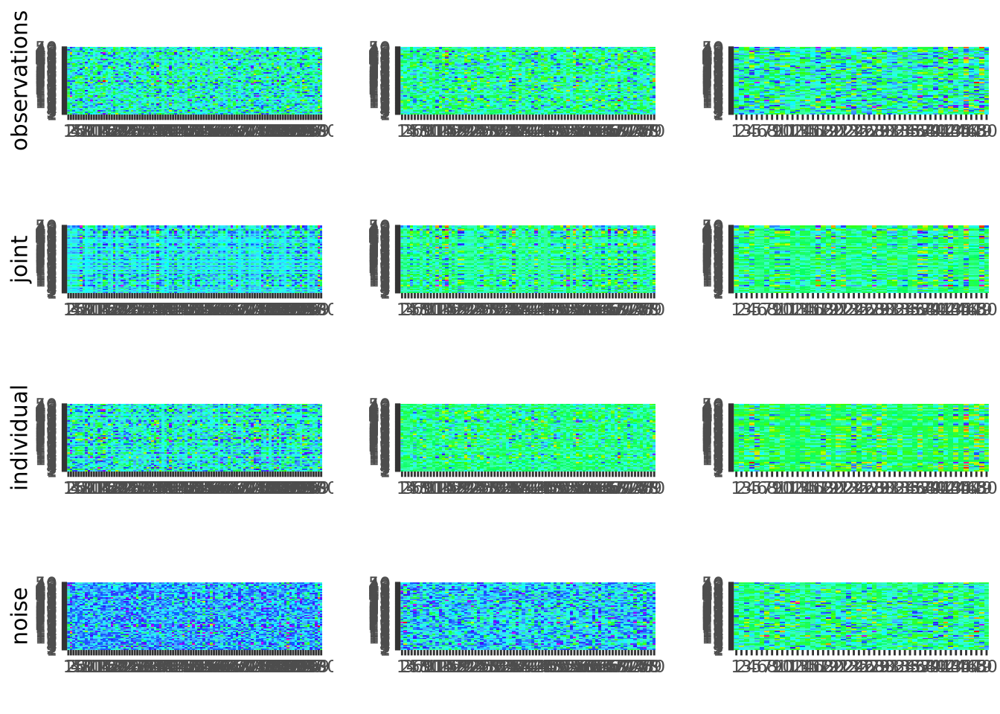

<!-- README.md is generated from README.Rmd. Please edit that file -->

# rajiveplus

<!-- badges: start -->

<!-- badges: end -->

**rajiveplus** is a fast, robust re-implementation of the Robust
Angle-based Joint and Individual Variation Explained (RaJIVE) algorithm
for multi-source / multi-omics data integration.

- **Decomposes** a list of data matrices (matched samples, possibly
  different feature spaces) into shared **joint**, block-specific
  **individual**, and residual **noise** components.
- **Robust** to a moderate fraction of element-wise outliers via an
  M-estimator (Huber loss) in the SVD step.
- **Fast**: the per-block robust SVD is implemented in C++ via
  RcppArmadillo, with optional cross-platform parallelism.
- **Interpretable**: ships with diagnostic plots, jackstraw
  feature-significance testing, metadata association, and bootstrap
  stability assessment.

See the package website for the full [function
reference](https://mdmanurung.github.io/rajiveplus/reference/) and the
[vignettes](https://mdmanurung.github.io/rajiveplus/articles/) for
benchmarks and applied analyses.

## Installation

The development version of rajiveplus can be installed from
[GitHub](https://github.com/mdmanurung/rajiveplus) with:

``` r
# install.packages("remotes")
remotes::install_github("mdmanurung/rajiveplus")
```

## Quickstart

The example below runs the full RaJIVE pipeline on simulated three-block
data, then shows how to inspect ranks, scores, loadings, variance
explained, and feature-level significance.

### Running robust aJIVE

``` r
library(rajiveplus)
set.seed(1)

# Simulate three blocks (matched samples, different feature spaces) with
# joint rank 3 and block-individual ranks (7, 6, 4).
n   <- 50
pks <- c(100, 80, 50)
Y   <- ajive.data.sim(K = 3, rankJ = 3, rankA = c(7, 6, 4),
                      n = n, pks = pks, dist.type = 1)

data.ajive           <- Y$sim_data
initial_signal_ranks <- c(7, 6, 4)
ajive.results.robust <- Rajive(data.ajive, initial_signal_ranks)
#> Loading required package: foreach
#> Loading required package: rngtools
```

The function returns a list of class `"rajive"` containing the RaJIVE
decomposition, with the joint component (shared across data sources),
individual component (data source specific) and residual component for
each data source.

### Inspecting the decomposition

- Print a concise overview:

``` r
print(ajive.results.robust)
#> RaJIVE Decomposition
#>   Number of blocks : 3
#>   Joint rank       : 2
#>   Individual ranks : 6, 5, 2
```

- Summary table of all ranks:

``` r
summary(ajive.results.robust)
#>   block joint_rank individual_rank
#>  block1          2               6
#>  block2          2               5
#>  block3          2               2
get_all_ranks(ajive.results.robust)
#>    block joint_rank individual_rank
#> 1 block1          2               6
#> 2 block2          2               5
#> 3 block3          2               2
```

- Joint rank:

``` r
get_joint_rank(ajive.results.robust)
#> [1] 2
```

- Individual ranks:

``` r
get_individual_rank(ajive.results.robust, 1)
#> [1] 6
get_individual_rank(ajive.results.robust, 2)
#> [1] 5
get_individual_rank(ajive.results.robust, 3)
#> [1] 2
```

- Shared joint scores (n × joint_rank matrix):

``` r
get_joint_scores(ajive.results.robust)
#>               [,1]         [,2]
#>  [1,] -0.129336872  0.004664267
#>  [2,]  0.062838110 -0.051406925
#>  [3,] -0.129562374 -0.052162238
#>  [4,]  0.168508417 -0.140081717
#>  [5,] -0.136768986  0.005251158
#>  [6,] -0.087444443  0.353927364
#>  [7,]  0.116384241  0.089953464
#>  [8,]  0.212139314  0.018945901
#>  [9,]  0.038900220  0.089969943
#> [10,]  0.108695234  0.301000515
#> [11,] -0.183952402 -0.064283274
#> [12,]  0.018486369 -0.163267220
#> [13,] -0.063075822  0.224032090
#> [14,] -0.218173070  0.010796817
#> [15,]  0.153550799 -0.134538546
#> [16,] -0.056993288 -0.028850280
#> [17,]  0.166370951 -0.153172396
#> [18,] -0.076284171 -0.019629212
#> [19,]  0.079684086  0.086751208
#> [20,] -0.230520660  0.021225080
#> [21,] -0.072635872 -0.002718613
#> [22,]  0.218265988  0.052856267
#> [23,] -0.080104975  0.064215569
#> [24,] -0.020038427 -0.016645077
#> [25,]  0.249136735  0.018316346
#> [26,] -0.003713757  0.221942474
#> [27,]  0.088398045  0.022442180
#> [28,] -0.131232933  0.148078299
#> [29,] -0.080388587  0.018677068
#> [30,]  0.116567887 -0.194023150
#> [31,]  0.189483996 -0.025315532
#> [32,]  0.001357426 -0.092018287
#> [33,] -0.008464911  0.072672765
#> [34,]  0.023654599 -0.287799622
#> [35,] -0.057540717  0.101669144
#> [36,] -0.263298305 -0.079966395
#> [37,] -0.192437608  0.065571095
#> [38,] -0.012841408 -0.079068729
#> [39,]  0.069896645 -0.067413448
#> [40,]  0.020523948 -0.023021568
#> [41,] -0.057152603 -0.279878128
#> [42,] -0.039857352  0.209600277
#> [43,] -0.205706601 -0.148316536
#> [44,] -0.089060227 -0.058148544
#> [45,] -0.300903674  0.033129207
#> [46,] -0.218914623 -0.025225932
#> [47,]  0.321884829  0.172774866
#> [48,]  0.104526207 -0.078343347
#> [49,] -0.036853634 -0.310479237
#> [50,]  0.047923624 -0.286604751
```

- Block-specific scores and loadings:

``` r
# Joint scores for block 1
get_block_scores(ajive.results.robust, k = 1, type = "joint")
#>               [,1]          [,2]
#>  [1,]  0.067373024 -0.1105018437
#>  [2,] -0.075585021  0.0296345168
#>  [3,]  0.017929333 -0.1385129847
#>  [4,] -0.204633304  0.0783784724
#>  [5,]  0.071522554 -0.1166955624
#>  [6,]  0.351433948  0.0969808717
#>  [7,]  0.021475731  0.1455187624
#>  [8,] -0.087313164  0.1942638600
#>  [9,]  0.059415697  0.0779589167
#> [10,]  0.209277273  0.2421135831
#> [11,]  0.033981432 -0.1918751879
#> [12,] -0.151421306 -0.0637927821
#> [13,]  0.226234627  0.0546519006
#> [14,]  0.116202825 -0.1849674657
#> [15,] -0.192478319  0.0680482524
#> [16,]  0.002738001 -0.0638206618
#> [17,] -0.215002476  0.0701071420
#> [18,]  0.020221174 -0.0761293953
#> [19,]  0.036646671  0.1119479664
#> [20,]  0.131340212 -0.1906306040
#> [21,]  0.033181909 -0.0646708719
#> [22,] -0.060741300  0.2162043498
#> [23,]  0.095205962 -0.0384222720
#> [24,] -0.004706826 -0.0256211426
#> [25,] -0.105971036  0.2262183476
#> [26,]  0.195356872  0.1053942442
#> [27,] -0.023697497  0.0880698266
#> [28,]  0.193361527 -0.0419593277
#> [29,]  0.055634123 -0.0609590196
#> [30,] -0.226248527  0.0066827334
#> [31,] -0.114821237  0.1528435290
#> [32,] -0.080906548 -0.0438558804
#> [33,]  0.067515646  0.0281890580
#> [34,] -0.262546185 -0.1202400216
#> [35,]  0.116821993 -0.0004135455
#> [36,]  0.059142296 -0.2687430197
#> [37,]  0.151370732 -0.1357155226
#> [38,] -0.062664415 -0.0498992660
#> [39,] -0.092997985  0.0279551204
#> [40,] -0.030121078  0.0066291550
#> [41,] -0.216086283 -0.1868285448
#> [42,]  0.202285150  0.0678351141
#> [43,] -0.028649689 -0.2519765780
#> [44,] -0.007115189 -0.1061242263
#> [45,]  0.176170807 -0.2461796332
#> [46,]  0.085153093 -0.2032459357
#> [47,] -0.006887061  0.3652582182
#> [48,] -0.119479022  0.0528031365
#> [49,] -0.252706781 -0.1841054846
#> [50,] -0.273383030 -0.0984920091

# Individual loadings for block 2
get_block_loadings(ajive.results.robust, k = 2, type = "individual")
#>                [,1]         [,2]         [,3]         [,4]          [,5]
#>  [1,] -0.1618990468 -0.027846551 -0.048097134  0.078435340 -8.937258e-02
#>  [2,] -0.0322644994  0.030457961  0.053797645  0.079444570 -9.801994e-02
#>  [3,]  0.0258899360  0.005656159  0.109858484  0.065360472 -5.472602e-02
#>  [4,] -0.0139002917 -0.047022099 -0.039154122 -0.038734714 -1.862205e-01
#>  [5,] -0.0709296615 -0.150100415 -0.144321482 -0.109086637  1.604676e-01
#>  [6,]  0.0610331811  0.054835285 -0.039762475  0.088562763 -1.053130e-01
#>  [7,]  0.1560538132  0.030237542 -0.039890651 -0.229270833 -3.880770e-02
#>  [8,]  0.0558953204 -0.198812432  0.077097544  0.166522731  2.327019e-02
#>  [9,]  0.0087632550  0.062548537  0.052320265 -0.136079708  4.829285e-02
#> [10,] -0.0296778745  0.081054025  0.058596359 -0.124514791  5.643123e-02
#> [11,]  0.0124509374  0.031734935  0.010519810  0.112320659 -1.027900e-01
#> [12,] -0.0020687324  0.054193391 -0.267090127 -0.055059575 -1.741040e-02
#> [13,] -0.0712250803  0.129795019 -0.033457706  0.130200202 -5.188865e-03
#> [14,] -0.1341477885 -0.012345535  0.172027689 -0.037173278 -3.011550e-01
#> [15,]  0.0080764790  0.269977996 -0.137201932  0.025782789 -1.210426e-01
#> [16,]  0.1123628481 -0.184175816  0.080024934  0.143470676 -8.849618e-02
#> [17,]  0.1410597773 -0.089972311 -0.091953034  0.086182231 -6.323171e-02
#> [18,]  0.1422909414  0.125559536  0.153363041  0.038672086 -1.087052e-01
#> [19,]  0.0047284259  0.104118800 -0.019056219 -0.108146849 -1.721219e-01
#> [20,]  0.0198153170  0.027033914  0.005501533 -0.080639697 -2.158865e-02
#> [21,]  0.1108755731  0.270843248  0.178471790  0.271038289 -1.136985e-01
#> [22,] -0.2202526900  0.148451954 -0.040277550 -0.040331377 -6.737864e-02
#> [23,]  0.1440257396 -0.113395563 -0.037840614 -0.148837368 -6.801792e-02
#> [24,]  0.1528453003 -0.034254736  0.163589618 -0.144701341 -1.458632e-01
#> [25,]  0.0008206224  0.157532050  0.161336987 -0.043581199  1.488163e-01
#> [26,] -0.0808478033  0.104268583  0.169526853  0.109004515 -2.301200e-01
#> [27,] -0.0668909379 -0.034304091 -0.158667270  0.055595352 -8.736014e-02
#> [28,]  0.1045124686  0.223532764 -0.161901410 -0.125284841 -1.478075e-01
#> [29,]  0.0281486428 -0.010724656 -0.039447227 -0.085600587  9.822032e-02
#> [30,] -0.0393316744  0.088447613 -0.123418036 -0.026572099  3.778895e-02
#> [31,]  0.0831599275  0.061206434  0.177631343  0.004266332  1.314432e-01
#> [32,] -0.1373477352  0.066414911 -0.011106816 -0.057561231  1.399098e-01
#> [33,]  0.0167180314  0.057373410 -0.044773527  0.055372179  1.151698e-01
#> [34,] -0.1227801161 -0.074982080  0.095015610 -0.099468681 -1.997093e-02
#> [35,] -0.2644175003 -0.032147501  0.118287472  0.077948004  8.276495e-02
#> [36,] -0.0392856699 -0.082515314 -0.116296374  0.247670777  1.345796e-01
#> [37,]  0.0474866180 -0.035598870  0.086171241  0.155755026 -1.021792e-01
#> [38,]  0.1380467301  0.048270222  0.049966349 -0.002849122  3.441683e-01
#> [39,]  0.0460483174 -0.116253887 -0.085932846  0.017519567 -4.641884e-02
#> [40,] -0.1067223776  0.069479236 -0.181790743  0.153666686  4.104121e-02
#> [41,] -0.1751462459  0.062161776 -0.105671552  0.024690735  3.927060e-02
#> [42,]  0.1154419976 -0.257489920 -0.017232242 -0.103248961  1.210586e-01
#> [43,]  0.1249153921  0.045622251  0.168648507 -0.196464240  1.332261e-01
#> [44,] -0.0568445985 -0.029036158  0.193681768  0.101244565 -1.180667e-01
#> [45,] -0.1837256193 -0.185055604  0.014468146 -0.120551053 -2.407739e-02
#> [46,] -0.1812138199  0.044712622  0.117100729 -0.126442211  3.034642e-02
#> [47,] -0.0476130343 -0.063621571 -0.008356553  0.106513723  1.401999e-01
#> [48,] -0.0819878602 -0.075921512 -0.209855930  0.024224510 -6.516853e-02
#> [49,]  0.2538633985 -0.087780382  0.006653687  0.069219504  1.151030e-01
#> [50,]  0.1093054722  0.138018575 -0.051900412  0.178072689  5.044012e-02
#> [51,]  0.0718571163  0.005488625  0.098381844 -0.056970238 -7.572477e-02
#> [52,] -0.0520847699 -0.017579603 -0.011594801 -0.078121997 -7.844743e-02
#> [53,] -0.0015016542  0.013951405  0.075404196  0.197099649  2.028075e-02
#> [54,] -0.0526953122  0.023357682 -0.066294464 -0.027995827 -7.739421e-02
#> [55,] -0.1751167580  0.100262522 -0.174996620  0.101154690  1.996354e-05
#> [56,]  0.2816976326  0.257424002  0.030446600 -0.033451598 -7.040712e-03
#> [57,]  0.0811650578  0.197229175  0.032181775 -0.022059333 -7.175451e-02
#> [58,] -0.1036348739 -0.046364629 -0.076554324  0.093708205 -3.385182e-02
#> [59,]  0.0370269132  0.126829733  0.032465634  0.053978512  3.651991e-02
#> [60,] -0.0540697990  0.092025810  0.216078609 -0.005692668  3.981115e-02
#> [61,] -0.0298156241  0.114444673 -0.034916917  0.105854597  3.960109e-02
#> [62,]  0.1046293450 -0.112383906  0.009456470  0.141107242 -5.487846e-02
#> [63,] -0.0976891321  0.124216580 -0.067008408  0.003897315  3.857051e-02
#> [64,] -0.1470570510  0.015793032  0.162309849  0.069438544  1.877137e-01
#> [65,]  0.1266264116 -0.133965561  0.031151246 -0.066162222 -1.137554e-02
#> [66,]  0.0718423152 -0.056438032 -0.049803777 -0.015216532 -9.577263e-02
#> [67,] -0.0176977094  0.137578681  0.082830519 -0.097885945 -1.231877e-01
#> [68,]  0.0780186235 -0.096369698 -0.118830751  0.039496340 -7.552712e-02
#> [69,] -0.2164805767 -0.058786762  0.332151439  0.166520405 -5.195646e-02
#> [70,]  0.0515506209  0.027107173  0.118934110 -0.027674663  9.898933e-02
#> [71,] -0.0403493033 -0.131877857  0.077493687 -0.116815144 -6.561841e-02
#> [72,]  0.2068480041  0.006496184 -0.047867336  0.268826030 -9.880408e-02
#> [73,] -0.0741007217 -0.064009274 -0.071388130  0.152901283  9.618685e-02
#> [74,]  0.0536060614 -0.102775043 -0.108369626  0.008256979 -1.082049e-01
#> [75,] -0.0603402017 -0.074190991  0.054077245  0.053293693  1.270877e-02
#> [76,]  0.0895961287 -0.075137744  0.030660462  0.169894957 -1.322797e-01
#> [77,] -0.0466190873  0.056403232 -0.034088877 -0.038271965  7.345342e-02
#> [78,]  0.0606089657  0.133302618  0.041522245  0.159516763  1.652826e-01
#> [79,] -0.0119922760 -0.219787322  0.098945169  0.067946584 -3.636339e-02
#> [80,] -0.1842371254 -0.094931465  0.114578090 -0.101323266 -2.752647e-01
```

- Full reconstructed matrices (J, I, or E) for a block:

``` r
J1 <- get_block_matrix(ajive.results.robust, k = 1, type = "joint")
I2 <- get_block_matrix(ajive.results.robust, k = 2, type = "individual")
E3 <- get_block_matrix(ajive.results.robust, k = 3, type = "noise")
```

### Visualizing results

- Heatmap decomposition:

``` r
decomposition_heatmaps_robustH(data.ajive, ajive.results.robust)
```



``` r
knitr::include_graphics("man/figures/README-heatmap-1.png")
```


- Proportion of variance explained (as a list):

``` r
showVarExplained_robust(ajive.results.robust, data.ajive)
#> $Joint
#> [1] 0.1888085 0.2233709 0.2823030
#> 
#> $Indiv
#> [1] 0.6481027 0.6106243 0.3768674
#> 
#> $Resid
#> [1] 0.1630888 0.1660047 0.3408296
```

- Proportion of variance explained (as a bar chart):

``` r
png("man/figures/README-variance-explained.png", width = 1600, height = 900, res = 150)
print(plot_variance_explained(ajive.results.robust, data.ajive))
dev.off()
#> png 
#>   2
knitr::include_graphics("man/figures/README-variance-explained.png")
```


- Scatter plot of scores (e.g. joint component 1 vs 2 for block 1):

``` r
png("man/figures/README-scores-joint.png", width = 1600, height = 900, res = 150)
print(plot_scores(ajive.results.robust, k = 1, type = "joint",
                  comp_x = 1, comp_y = 2))
dev.off()
#> png 
#>   2
knitr::include_graphics("man/figures/README-scores-joint.png")
```


``` r

# Colour points by a grouping variable
group_labels <- rep(c("A", "B"), each = n / 2)
png("man/figures/README-scores-joint-grouped.png", width = 1600, height = 900, res = 150)
print(plot_scores(ajive.results.robust, k = 1, type = "joint",
                  comp_x = 1, comp_y = 2, group = group_labels))
dev.off()
#> png 
#>   2
knitr::include_graphics("man/figures/README-scores-joint-grouped.png")
```


### Jackstraw significance testing

After running the RaJIVE decomposition, you can test which variables in
each data block have statistically significantly non-zero joint loadings
using the jackstraw permutation test.

By default, `jackstraw_rajive()` applies global BH (Benjamini–Hochberg)
correction across all block/component/feature tests. BH is appropriate
under positive regression dependency; pass `correction = "BY"` for the
more conservative Benjamini–Yekutieli adjustment under arbitrary feature
dependence. Pass `pip = TRUE` (requires Bioconductor `qvalue`) for
posterior inclusion probabilities in addition to p-values.

``` r
# Run jackstraw testing; increase n_null when finer tail resolution is needed
js <- jackstraw_rajive(ajive.results.robust, data.ajive,
                       alpha = 0.05, n_null = 10)

# Conservative FDR adjustment for strongly dependent features
js_by <- jackstraw_rajive(ajive.results.robust, data.ajive,
                          alpha = 0.05, n_null = 10,
                          correction = "BY")

# Posterior inclusion probabilities via qvalue::lfdr()
js_pip <- jackstraw_rajive(ajive.results.robust, data.ajive,
                           alpha = 0.05, n_null = 10,
                           pip = TRUE)

# Print a concise summary table
print(js)

# Get a data frame summary
summary(js)
```

### AJIVE diagnostics and interpretation helpers

The package now includes unified helpers for diagnostics, metadata
association, and bootstrap stability assessment:

``` r
# Extract AJIVE rank diagnostics (wide or long format)
diag_wide <- extract_components(ajive.results.robust, what = "rank_diagnostics")
diag_long <- extract_components(ajive.results.robust, what = "rank_diagnostics", format = "long")
head(diag_long)

# Unified diagnostic plots
png("man/figures/README-rank-threshold.png", width = 1600, height = 900, res = 150)
print(plot_components(ajive.results.robust, plot_type = "rank_threshold"))
dev.off()
knitr::include_graphics("man/figures/README-rank-threshold.png")
png("man/figures/README-bound-distributions.png", width = 1600, height = 900, res = 150)
print(plot_components(ajive.results.robust, plot_type = "bound_distributions"))
dev.off()
knitr::include_graphics("man/figures/README-bound-distributions.png")

# Associate estimated joint scores with sample-level metadata
metadata_df <- data.frame(group = rep(c("A", "B"), each = n / 2))
associate_components(ajive.results.robust, metadata_df,
                     variable = "group", mode = "categorical")

# Bootstrap stability of estimated joint rank
# (set B >= 100 for publication use; eval=FALSE here to keep README build fast)
assess_stability(ajive.results.robust, data.ajive, initial_signal_ranks,
                 target = "joint_rank", B = 20)
```

- Retrieve significant variables for a given block and component:

``` r
get_significant_vars(js, block = 1, component = 1)
```

- Visualize jackstraw results (three plot types available):

``` r
# P-value histogram
png("man/figures/README-jackstraw-pvalue-hist.png", width = 1600, height = 900, res = 150)
print(plot_jackstraw(js, type = "pvalue_hist", block = 1, component = 1))
dev.off()
knitr::include_graphics("man/figures/README-jackstraw-pvalue-hist.png")

# F-statistic vs -log10(p-value) scatter plot
png("man/figures/README-jackstraw-scatter.png", width = 1600, height = 900, res = 150)
print(plot_jackstraw(js, type = "scatter", block = 1, component = 1))
dev.off()
knitr::include_graphics("man/figures/README-jackstraw-scatter.png")

# Heatmap of -log10(p-value) across all joint components for one block
png("man/figures/README-jackstraw-loadings-significance.png", width = 1600, height = 900, res = 150)
print(plot_jackstraw(js, type = "loadings_significance", block = 1))
dev.off()
knitr::include_graphics("man/figures/README-jackstraw-loadings-significance.png")
```

## Function reference

### Core decomposition

| Function | Description |
|----|----|
| `Rajive()` | Run the RaJIVE decomposition on a list of data matrices. Returns an object of class `"rajive"` with joint, individual, and residual decompositions plus joint-rank diagnostics. |
| `ajive.data.sim()` | Simulate multi-block data with known joint and individual structure for testing and benchmarking. |
| `sim_dist()` | Generate centred simulation noise distributions used by `ajive.data.sim()`. |

### Rank accessors

| Function | Description |
|----|----|
| `get_joint_rank()` | Extract the estimated joint rank from a `"rajive"` object. |
| `get_individual_rank()` | Extract the individual rank for a specific data block. |
| `get_all_ranks()` | Return a `data.frame` of joint and individual ranks for all blocks at once. |

### Component accessors

| Function | Description |
|----|----|
| `get_joint_scores()` | Return the shared n x r_J joint score matrix (r_J = joint rank). |
| `get_block_scores()` | Return the score matrix (U) for a given block and component type (joint or individual). |
| `get_block_loadings()` | Return the loading matrix (V) for a given block and component type. |
| `get_block_matrix()` | Return the full reconstructed matrix (J, I, or E) for a given block and component type. |
| `extract_components()` | Extract scores, loadings, variance tables, jackstraw significance tables, or rank diagnostics in wide or long format. |

### S3 methods for `"rajive"` objects

| Function | Description |
|----|----|
| `print.rajive()` | Print a concise summary of ranks for a `"rajive"` object. |
| `summary.rajive()` | Return and print a `data.frame` of all estimated ranks. |

### Variance explained

| Function | Description |
|----|----|
| `showVarExplained_robust()` | Compute the proportion of variance explained by joint, individual, and residual components for each block (returns a list). |
| `plot_variance_explained()` | Stacked bar chart of variance explained by each component and block. |

### Diagnostics and interpretation

| Function | Description |
|----|----|
| `extract_components()` | Extract AJIVE rank diagnostics, scores, loadings, variance summaries, or jackstraw significance in wide-list or long-data-frame format. |
| `plot_components()` | Unified diagnostic and interpretation plotting, including `rank_threshold`, `bound_distributions`, and `ajive_diagnostic`. |
| `rank_features()` | Rank top loadings, feature contributions, cross-block feature-set overlap, or jackstraw-significant features. |
| `get_top_loadings()` | Thin wrapper around `rank_features(mode = "top_loadings")`. |
| `get_feature_contributions()` | Thin wrapper around `rank_features(mode = "contribution")`. |
| `compare_feature_sets_across_blocks()` | Thin wrapper around `rank_features(mode = "overlap")`. |
| `summarize_significant_vars()` | Thin wrapper around `rank_features(mode = "significant")`. |
| `summarize_components()` | Summarize ranks, variance, significance counts, associations, or stability output. |
| `associate_components()` | Test associations between estimated component scores and sample metadata. |
| `associate_scores_continuous()` / `associate_scores_categorical()` / `associate_scores_survival()` | Compatibility wrappers for common association modes. |
| `assess_stability()` | Bootstrap-based stability assessment for joint rank, loadings, or components, with Procrustes alignment where needed. |
| `bootstrap_joint_rank()` / `bootstrap_loading_stability()` | Compatibility wrappers around `assess_stability()`. |
| `export_results()` | Export tables, R objects, and lists of ggplot objects. |
| `rajive_report()` | Build a lightweight HTML or Markdown interpretation report. |

### Visualisation

| Function | Description |
|----|----|
| `decomposition_heatmaps_robustH()` | Heatmaps of the raw data and the joint, individual, and noise components for all blocks. |
| `plot_scores()` | Scatter plot of two score components for a given block (joint or individual), with optional group colouring. |
| `plot_components()` | Unified plotting entry point for score pairs/densities, top features, component heatmaps, variance, associations, jackstraw summaries, stability, and rank diagnostics. |
| `plot_stability_heatmap()` | Compatibility wrapper for stability plots. |
| `autoplot.rajive()` / `autoplot.jackstraw_rajive()` | `ggplot2::autoplot()` methods for decomposition and jackstraw objects. |
| `fortify.rajive()` / `fortify.jackstraw_rajive()` | `ggplot2::fortify()` methods for tidy plotting data. |

### Jackstraw significance testing

| Function | Description |
|----|----|
| `jackstraw_rajive()` | Run the jackstraw permutation test to identify features significantly associated with estimated joint scores. Default multiple-testing correction is global BH; optional `correction = "BY"` gives conservative arbitrary-dependence control. Optional `pip = TRUE` adds posterior inclusion probabilities via `qvalue::lfdr()`. |
| `print.jackstraw_rajive()` | Print a significance table for a `"jackstraw_rajive"` object. |
| `summary.jackstraw_rajive()` | Return and print a `data.frame` summary of jackstraw results. |
| `get_significant_vars()` | Extract significant variable names/indices for a given block and component from jackstraw results. |
| `plot_jackstraw()` | Diagnostic plots for jackstraw results: p-value histogram, F-stat scatter plot, or loadings significance heatmap. |

## Where to next

- **Function reference:** every exported function is documented at
  <https://mdmanurung.github.io/rajiveplus/reference/>.
- **Vignettes** (under `vignettes/` and on the package website):
  - `function_gallery` — short, runnable demos of every exported
    function.
  - `benchmarking` — runtime / memory comparison vs the original
    `RaJIVE` package.
  - `jackstraw_scaling` — practical guide to choosing `n_null` for
    `jackstraw_rajive()`.
  - `cll_application` — end-to-end multi-omics integration on the CLL
    cohort (Dietrich et al. 2018).
  - `microbiome_application` — multi-kingdom gut microbiome integration
    (Haak et al. 2021).

## Interpretation notes

A few caveats worth keeping in mind when interpreting `Rajive()` output:

- **Joint rank threshold** combines a Wedin bound with a
  random-direction (or permutation) bound via `max()`. The rule is
  conservative in practice but does not carry a formal FWER/FDR
  guarantee for rank selection.
- **Random-direction null uses classical SVD.** The random-direction
  bound uses i.i.d. Gaussian draws, where the M-estimator only adds
  Monte-Carlo noise without removing bias. `rajiveplus` therefore uses
  `base::svd()` inside `get_random_direction_bound_robustH()`, matching
  the AJIVE reference implementation. The robust SVD is still used for
  every other step in the pipeline, including signal-block SVDs and the
  joint and individual decompositions.
- **Identifiability filtering defaults to L2.** `Rajive()` compares
  `X_k^T joint_score` to each block's singular-value threshold with an
  L2 norm by default, matching the scale of the threshold. Use
  `identifiability_norm = "l1"` when closer parity with original
  RaJIVE's `norm(score)` behavior is needed.
- **Component scores are estimates**, not fixed design variables.
  Downstream tests via `associate_components()` and `jackstraw_rajive()`
  do not propagate score-estimation uncertainty and should be treated as
  post-decomposition exploratory analyses.
- For survival outcomes, prefer `split = "none"` (continuous-score Cox
  model) for primary inference; median/tertile splits are data-adaptive
  and may be anti-conservative.
