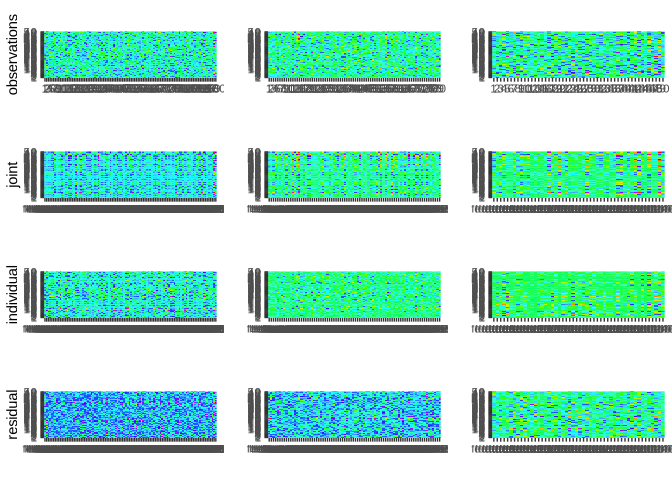
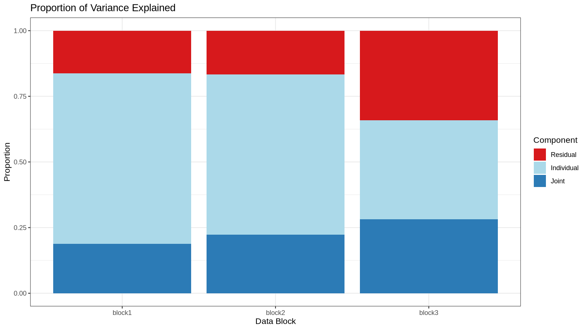
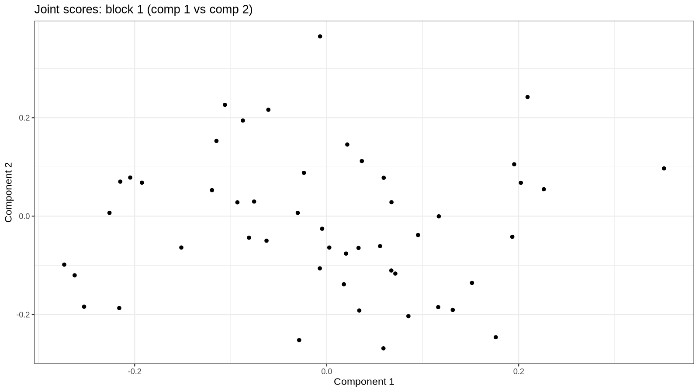
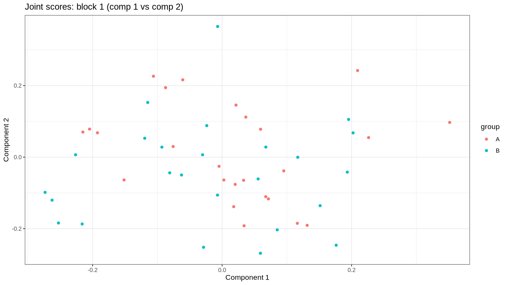

<!-- README.md is generated from README.Rmd. Please edit that file -->

# rajiveplus

<!-- badges: start -->

<!-- badges: end -->

**rajiveplus** is a fast, robust re-implementation of the Robust
Angle-based Joint and Individual Variation Explained (RaJIVE) algorithm
for multi-source / multi-omics data integration.

- **Decomposes** a list of data matrices (matched samples, possibly
  different feature spaces) into shared **joint**, block-specific
  **individual**, and **residual** components.
- **Robust** to a moderate fraction of element-wise outliers via an
  M-estimator (Huber loss) in the SVD step.
- **Fast**: the per-block robust SVD is implemented in C++ via
  RcppArmadillo, with optional cross-platform parallelism.
- **Interpretable**: ships with diagnostic plots, jackstraw
  feature-significance testing, metadata association, and bootstrap
  stability assessment.

See the package website for the full [function
reference](https://mdmanurung.github.io/rajiveplus/reference/) and the
[vignettes](https://mdmanurung.github.io/rajiveplus/articles/) for
benchmarks and applied analyses.

## Validation status

The 0.2.0-rc1 completion stream enforces matched-sample and rank
contracts, records method profiles, and reports matrix and energy
closure separately. Exact Individual reprojection, exhaustive
identifiability rejection, and revised Wedin boundary handling are
implemented and tested only as internal candidate methods; the frozen
default retains its prior behavior. Native missing-data fitting remains
**experimental**: its observed-entry diagnostics do not establish
recovery or coverage for every missingness mechanism.
`jackstraw_rajive()` is a fixed-score, approximate procedure; its pooled
PIP option is also experimental.

The classical projector-sum aggregation candidate was rejected in the
frozen local pilot because contamination scenarios exceeded the
predeclared projector error margin. The robust aggregation default was
retained. Remote CI, scheduled calibration, downstream BMV regeneration,
publication, and release tagging are not local validation results.

This package extends the original [RaJIVE
implementation](https://github.com/ericaponzi/RaJIVE) by Erica Ponzi.
The exact upstream commit could not be pinned in the frozen 0.2.0 local
packet because the cited local clone was absent and network access was
prohibited.

## Installation

The development version of rajiveplus can be installed from
[GitHub](https://github.com/mdmanurung/rajiveplus) with:

``` r
# install.packages("remotes")
remotes::install_github("mdmanurung/rajiveplus")
```

## Quickstart

The example below runs the full RaJIVE pipeline on simulated three-block
data, then shows how to inspect ranks, scores, loadings, variance
explained, and feature-level significance.

### Running robust aJIVE

``` r
library(rajiveplus)
set.seed(1)

# Simulate three blocks (matched samples, different feature spaces) with
# joint rank 3 and block-individual ranks (7, 6, 4).
n   <- 50
pks <- c(100, 80, 50)
Y   <- ajive.data.sim(K = 3, rankJ = 3, rankA = c(7, 6, 4),
                      n = n, pks = pks, dist.type = 1)

data.ajive           <- Y$sim_data
initial_signal_ranks <- c(7, 6, 4)
ajive.results.robust <- Rajive(data.ajive, initial_signal_ranks)
#> Rajive() uses identifiability_norm = "l2" by default; use "l1" for closer
#> original RaJIVE parity.
```

The function returns a list of class `"rajive"` containing the RaJIVE
decomposition, with the joint component (shared across data sources),
individual component (data source specific) and residual component for
each data source.

### Inspecting the decomposition

- Print a concise overview:

``` r
print(ajive.results.robust)
#> RaJIVE Decomposition
#>   Number of blocks : 3
#>   Joint rank       : 2
#>   Individual ranks : 6, 5, 2
```

- Summary table of all ranks:

``` r
summary(ajive.results.robust)
#>   block joint_rank individual_rank
#>  block1          2               6
#>  block2          2               5
#>  block3          2               2
get_all_ranks(ajive.results.robust)
#>    block joint_rank individual_rank
#> 1 block1          2               6
#> 2 block2          2               5
#> 3 block3          2               2
```

- Joint rank:

``` r
get_joint_rank(ajive.results.robust)
#> [1] 2
```

- Individual ranks:

``` r
get_individual_rank(ajive.results.robust, 1)
#> [1] 6
get_individual_rank(ajive.results.robust, 2)
#> [1] 5
get_individual_rank(ajive.results.robust, 3)
#> [1] 2
```

- Shared joint scores (n × joint_rank matrix):

``` r
get_joint_scores(ajive.results.robust)
#>               [,1]         [,2]
#>  [1,] -0.129336872  0.004664267
#>  [2,]  0.062838110 -0.051406926
#>  [3,] -0.129562374 -0.052162237
#>  [4,]  0.168508416 -0.140081717
#>  [5,] -0.136768986  0.005251158
#>  [6,] -0.087444443  0.353927364
#>  [7,]  0.116384241  0.089953463
#>  [8,]  0.212139315  0.018945901
#>  [9,]  0.038900220  0.089969943
#> [10,]  0.108695234  0.301000516
#> [11,] -0.183952401 -0.064283272
#> [12,]  0.018486369 -0.163267220
#> [13,] -0.063075822  0.224032090
#> [14,] -0.218173067  0.010796818
#> [15,]  0.153550799 -0.134538546
#> [16,] -0.056993288 -0.028850280
#> [17,]  0.166370952 -0.153172396
#> [18,] -0.076284171 -0.019629211
#> [19,]  0.079684086  0.086751207
#> [20,] -0.230520660  0.021225080
#> [21,] -0.072635873 -0.002718613
#> [22,]  0.218265987  0.052856267
#> [23,] -0.080104975  0.064215568
#> [24,] -0.020038427 -0.016645078
#> [25,]  0.249136735  0.018316346
#> [26,] -0.003713758  0.221942475
#> [27,]  0.088398044  0.022442180
#> [28,] -0.131232932  0.148078297
#> [29,] -0.080388587  0.018677068
#> [30,]  0.116567888 -0.194023150
#> [31,]  0.189483995 -0.025315532
#> [32,]  0.001357426 -0.092018287
#> [33,] -0.008464912  0.072672766
#> [34,]  0.023654599 -0.287799622
#> [35,] -0.057540717  0.101669144
#> [36,] -0.263298305 -0.079966395
#> [37,] -0.192437608  0.065571095
#> [38,] -0.012841408 -0.079068729
#> [39,]  0.069896645 -0.067413447
#> [40,]  0.020523948 -0.023021567
#> [41,] -0.057152603 -0.279878128
#> [42,] -0.039857353  0.209600275
#> [43,] -0.205706602 -0.148316536
#> [44,] -0.089060228 -0.058148544
#> [45,] -0.300903674  0.033129207
#> [46,] -0.218914624 -0.025225933
#> [47,]  0.321884830  0.172774866
#> [48,]  0.104526206 -0.078343347
#> [49,] -0.036853634 -0.310479237
#> [50,]  0.047923624 -0.286604750
```

- Block-specific scores and loadings:

``` r
# Joint scores for block 1
get_block_scores(ajive.results.robust, k = 1, type = "joint")
#>               [,1]         [,2]
#>  [1,]  0.067373024 -0.110501844
#>  [2,] -0.075585022  0.029634517
#>  [3,]  0.017929334 -0.138512984
#>  [4,] -0.204633304  0.078378471
#>  [5,]  0.071522555 -0.116695563
#>  [6,]  0.351433949  0.096980873
#>  [7,]  0.021475730  0.145518762
#>  [8,] -0.087313164  0.194263860
#>  [9,]  0.059415697  0.077958917
#> [10,]  0.209277273  0.242113584
#> [11,]  0.033981433 -0.191875186
#> [12,] -0.151421305 -0.063792782
#> [13,]  0.226234627  0.054651901
#> [14,]  0.116202824 -0.184967462
#> [15,] -0.192478320  0.068048252
#> [16,]  0.002738000 -0.063820662
#> [17,] -0.215002477  0.070107142
#> [18,]  0.020221174 -0.076129395
#> [19,]  0.036646671  0.111947966
#> [20,]  0.131340213 -0.190630604
#> [21,]  0.033181909 -0.064670873
#> [22,] -0.060741300  0.216204349
#> [23,]  0.095205962 -0.038422273
#> [24,] -0.004706827 -0.025621142
#> [25,] -0.105971037  0.226218348
#> [26,]  0.195356872  0.105394245
#> [27,] -0.023697496  0.088069827
#> [28,]  0.193361525 -0.041959327
#> [29,]  0.055634123 -0.060959019
#> [30,] -0.226248528  0.006682734
#> [31,] -0.114821237  0.152843528
#> [32,] -0.080906548 -0.043855881
#> [33,]  0.067515647  0.028189058
#> [34,] -0.262546185 -0.120240022
#> [35,]  0.116821992 -0.000413545
#> [36,]  0.059142296 -0.268743020
#> [37,]  0.151370732 -0.135715522
#> [38,] -0.062664415 -0.049899267
#> [39,] -0.092997984  0.027955120
#> [40,] -0.030121077  0.006629155
#> [41,] -0.216086282 -0.186828545
#> [42,]  0.202285149  0.067835114
#> [43,] -0.028649688 -0.251976579
#> [44,] -0.007115189 -0.106124226
#> [45,]  0.176170808 -0.246179633
#> [46,]  0.085153093 -0.203245937
#> [47,] -0.006887062  0.365258219
#> [48,] -0.119479022  0.052803136
#> [49,] -0.252706781 -0.184105485
#> [50,] -0.273383029 -0.098492009

# Individual loadings for block 2
get_block_loadings(ajive.results.robust, k = 2, type = "individual")
#>                   [,1]         [,2]         [,3]         [,4]          [,5]
#> feature1  -0.161899047 -0.027846552 -0.048097135  0.078435340 -8.937258e-02
#> feature2  -0.032264499  0.030457961  0.053797645  0.079444569 -9.801994e-02
#> feature3   0.025889936  0.005656159  0.109858484  0.065360472 -5.472602e-02
#> feature4  -0.013900292 -0.047022099 -0.039154122 -0.038734714 -1.862205e-01
#> feature5  -0.070929661 -0.150100415 -0.144321481 -0.109086638  1.604676e-01
#> feature6   0.061033181  0.054835285 -0.039762475  0.088562763 -1.053130e-01
#> feature7   0.156053813  0.030237542 -0.039890651 -0.229270833 -3.880770e-02
#> feature8   0.055895321 -0.198812432  0.077097545  0.166522731  2.327019e-02
#> feature9   0.008763255  0.062548537  0.052320265 -0.136079709  4.829285e-02
#> feature10 -0.029677875  0.081054025  0.058596359 -0.124514790  5.643123e-02
#> feature11  0.012450937  0.031734935  0.010519810  0.112320659 -1.027900e-01
#> feature12 -0.002068733  0.054193391 -0.267090127 -0.055059575 -1.741040e-02
#> feature13 -0.071225080  0.129795019 -0.033457707  0.130200201 -5.188865e-03
#> feature14 -0.134147789 -0.012345535  0.172027690 -0.037173278 -3.011550e-01
#> feature15  0.008076479  0.269977996 -0.137201932  0.025782788 -1.210426e-01
#> feature16  0.112362849 -0.184175815  0.080024934  0.143470677 -8.849618e-02
#> feature17  0.141059778 -0.089972311 -0.091953034  0.086182231 -6.323171e-02
#> feature18  0.142290941  0.125559536  0.153363041  0.038672086 -1.087052e-01
#> feature19  0.004728426  0.104118799 -0.019056219 -0.108146849 -1.721219e-01
#> feature20  0.019815317  0.027033913  0.005501533 -0.080639697 -2.158865e-02
#> feature21  0.110875573  0.270843249  0.178471789  0.271038289 -1.136985e-01
#> feature22 -0.220252690  0.148451953 -0.040277550 -0.040331378 -6.737864e-02
#> feature23  0.144025740 -0.113395563 -0.037840613 -0.148837368 -6.801792e-02
#> feature24  0.152845300 -0.034254736  0.163589618 -0.144701341 -1.458632e-01
#> feature25  0.000820622  0.157532050  0.161336987 -0.043581198  1.488163e-01
#> feature26 -0.080847804  0.104268583  0.169526853  0.109004516 -2.301200e-01
#> feature27 -0.066890938 -0.034304091 -0.158667270  0.055595353 -8.736014e-02
#> feature28  0.104512468  0.223532764 -0.161901411 -0.125284842 -1.478075e-01
#> feature29  0.028148643 -0.010724656 -0.039447227 -0.085600587  9.822032e-02
#> feature30 -0.039331675  0.088447613 -0.123418037 -0.026572099  3.778895e-02
#> feature31  0.083159927  0.061206435  0.177631343  0.004266333  1.314432e-01
#> feature32 -0.137347735  0.066414910 -0.011106816 -0.057561231  1.399098e-01
#> feature33  0.016718031  0.057373410 -0.044773527  0.055372179  1.151698e-01
#> feature34 -0.122780116 -0.074982081  0.095015610 -0.099468680 -1.997093e-02
#> feature35 -0.264417500 -0.032147502  0.118287472  0.077948004  8.276495e-02
#> feature36 -0.039285670 -0.082515314 -0.116296374  0.247670777  1.345796e-01
#> feature37  0.047486618 -0.035598870  0.086171240  0.155755026 -1.021792e-01
#> feature38  0.138046730  0.048270223  0.049966350 -0.002849122  3.441683e-01
#> feature39  0.046048318 -0.116253887 -0.085932846  0.017519567 -4.641884e-02
#> feature40 -0.106722378  0.069479236 -0.181790743  0.153666685  4.104121e-02
#> feature41 -0.175146246  0.062161776 -0.105671552  0.024690735  3.927060e-02
#> feature42  0.115441998 -0.257489919 -0.017232241 -0.103248961  1.210586e-01
#> feature43  0.124915392  0.045622252  0.168648508 -0.196464239  1.332261e-01
#> feature44 -0.056844598 -0.029036158  0.193681768  0.101244565 -1.180667e-01
#> feature45 -0.183725619 -0.185055605  0.014468147 -0.120551052 -2.407739e-02
#> feature46 -0.181213820  0.044712621  0.117100729 -0.126442211  3.034642e-02
#> feature47 -0.047613034 -0.063621571 -0.008356553  0.106513724  1.401999e-01
#> feature48 -0.081987860 -0.075921512 -0.209855930  0.024224510 -6.516853e-02
#> feature49  0.253863399 -0.087780381  0.006653687  0.069219505  1.151030e-01
#> feature50  0.109305472  0.138018576 -0.051900412  0.178072689  5.044012e-02
#> feature51  0.071857116  0.005488626  0.098381845 -0.056970237 -7.572478e-02
#> feature52 -0.052084770 -0.017579604 -0.011594801 -0.078121997 -7.844743e-02
#> feature53 -0.001501654  0.013951406  0.075404196  0.197099650  2.028075e-02
#> feature54 -0.052695312  0.023357682 -0.066294464 -0.027995828 -7.739421e-02
#> feature55 -0.175116758  0.100262522 -0.174996620  0.101154689  1.996425e-05
#> feature56  0.281697632  0.257424003  0.030446600 -0.033451598 -7.040712e-03
#> feature57  0.081165057  0.197229175  0.032181775 -0.022059333 -7.175451e-02
#> feature58 -0.103634874 -0.046364630 -0.076554324  0.093708206 -3.385182e-02
#> feature59  0.037026913  0.126829733  0.032465634  0.053978512  3.651991e-02
#> feature60 -0.054069799  0.092025810  0.216078609 -0.005692667  3.981115e-02
#> feature61 -0.029815624  0.114444673 -0.034916917  0.105854597  3.960109e-02
#> feature62  0.104629345 -0.112383905  0.009456470  0.141107243 -5.487846e-02
#> feature63 -0.097689132  0.124216579 -0.067008408  0.003897314  3.857051e-02
#> feature64 -0.147057051  0.015793031  0.162309849  0.069438544  1.877137e-01
#> feature65  0.126626412 -0.133965561  0.031151246 -0.066162222 -1.137554e-02
#> feature66  0.071842316 -0.056438032 -0.049803777 -0.015216532 -9.577263e-02
#> feature67 -0.017697710  0.137578681  0.082830519 -0.097885946 -1.231877e-01
#> feature68  0.078018624 -0.096369698 -0.118830752  0.039496340 -7.552712e-02
#> feature69 -0.216480576 -0.058786762  0.332151438  0.166520405 -5.195646e-02
#> feature70  0.051550621  0.027107174  0.118934111 -0.027674663  9.898933e-02
#> feature71 -0.040349303 -0.131877858  0.077493687 -0.116815143 -6.561841e-02
#> feature72  0.206848004  0.006496184 -0.047867337  0.268826030 -9.880407e-02
#> feature73 -0.074100722 -0.064009274 -0.071388130  0.152901284  9.618685e-02
#> feature74  0.053606062 -0.102775043 -0.108369626  0.008256979 -1.082049e-01
#> feature75 -0.060340202 -0.074190991  0.054077245  0.053293693  1.270877e-02
#> feature76  0.089596129 -0.075137744  0.030660461  0.169894957 -1.322797e-01
#> feature77 -0.046619087  0.056403232 -0.034088877 -0.038271966  7.345342e-02
#> feature78  0.060608965  0.133302619  0.041522245  0.159516763  1.652826e-01
#> feature79 -0.011992275 -0.219787322  0.098945169  0.067946584 -3.636339e-02
#> feature80 -0.184237125 -0.094931466  0.114578091 -0.101323266 -2.752647e-01
```

- Full reconstructed matrices (joint, individual, or residual) for a
  block:

``` r
J1 <- get_block_matrix(ajive.results.robust, k = 1, type = "joint")
I2 <- get_block_matrix(ajive.results.robust, k = 2, type = "individual")
R3 <- get_block_matrix(ajive.results.robust, k = 3, type = "residual")
```

### Visualizing results

- Heatmap decomposition:

``` r
decomposition_heatmaps_robustH(data.ajive, ajive.results.robust)
```



``` r
knitr::include_graphics("man/figures/README-heatmap-1.png")
```


- Proportion of variance explained (as a list):

``` r
showVarExplained_robust(ajive.results.robust, data.ajive)
#> $Joint
#> [1] 0.1888085 0.2233709 0.2823030
#> 
#> $Individual
#> [1] 0.6481027 0.6106243 0.3768674
#> 
#> $Residual
#> [1] 0.1630888 0.1660047 0.3408296
```

- Proportion of variance explained (as a bar chart):

``` r
png("man/figures/README-variance-explained.png", width = 1600, height = 900, res = 150)
print(plot_variance_explained(ajive.results.robust, data.ajive))
dev.off()
#> png 
#>   2

```


- Scatter plot of scores (e.g. joint component 1 vs 2 for block 1):

``` r
png("man/figures/README-scores-joint.png", width = 1600, height = 900, res = 150)
print(plot_scores(ajive.results.robust, k = 1, type = "joint",
                  comp_x = 1, comp_y = 2))
dev.off()
#> png 
#>   2

```


``` r

# Colour points by a grouping variable
group_labels <- rep(c("A", "B"), each = n / 2)
png("man/figures/README-scores-joint-grouped.png", width = 1600, height = 900, res = 150)
print(plot_scores(ajive.results.robust, k = 1, type = "joint",
                  comp_x = 1, comp_y = 2, group = group_labels))
dev.off()
#> png 
#>   2

```


### Jackstraw significance testing

After running the RaJIVE decomposition, you can test which variables in
each data block have statistically significantly non-zero joint loadings
using the jackstraw permutation test.

By default, `jackstraw_rajive()` applies global BH (Benjamini–Hochberg)
correction across all block/component/feature tests. BH is appropriate
under positive regression dependency; pass `correction = "BY"` for the
more conservative Benjamini–Yekutieli adjustment under arbitrary feature
dependence. Pass `pip = TRUE` (requires Bioconductor `qvalue`) for
posterior inclusion probabilities in addition to p-values.

``` r
# Run jackstraw testing; increase n_null when finer tail resolution is needed
js <- jackstraw_rajive(ajive.results.robust, data.ajive,
                       alpha = 0.05, n_null = 10)

# Conservative FDR adjustment for strongly dependent features
js_by <- jackstraw_rajive(ajive.results.robust, data.ajive,
                          alpha = 0.05, n_null = 10,
                          correction = "BY")

# Posterior inclusion probabilities via qvalue::lfdr()
js_pip <- jackstraw_rajive(ajive.results.robust, data.ajive,
                           alpha = 0.05, n_null = 10,
                           pip = TRUE)

# Print a concise summary table
print(js)

# Get a data frame summary
summary(js)
```

### AJIVE diagnostics and interpretation helpers

The package now includes unified helpers for diagnostics, metadata
association, and bootstrap stability assessment:

``` r
# Extract AJIVE rank diagnostics (wide or long format)
diag_wide <- extract_components(ajive.results.robust, what = "rank_diagnostics")
diag_long <- extract_components(ajive.results.robust, what = "rank_diagnostics", format = "long")
head(diag_long)

# Unified diagnostic plots
png("man/figures/README-rank-threshold.png", width = 1600, height = 900, res = 150)
print(plot_components(ajive.results.robust, plot_type = "rank_threshold"))
dev.off()
knitr::include_graphics("man/figures/README-rank-threshold.png")
png("man/figures/README-bound-distributions.png", width = 1600, height = 900, res = 150)
print(plot_components(ajive.results.robust, plot_type = "bound_distributions"))
dev.off()
knitr::include_graphics("man/figures/README-bound-distributions.png")

# Associate estimated joint scores with sample-level metadata
metadata_df <- data.frame(group = rep(c("A", "B"), each = n / 2))
associate_components(ajive.results.robust, metadata_df,
                     variable = "group", mode = "categorical")

# Bootstrap stability of estimated joint rank
# (set B >= 100 for publication use; eval=FALSE here to keep README build fast)
assess_stability(ajive.results.robust, data.ajive, initial_signal_ranks,
                 target = "joint_rank", B = 20)
```

- Retrieve significant variables for a given block and component:

``` r
get_significant_vars(js, block = 1, component = 1)
```

- Visualize jackstraw results (three plot types available):

``` r
# P-value histogram
png("man/figures/README-jackstraw-pvalue-hist.png", width = 1600, height = 900, res = 150)
print(plot_jackstraw(js, type = "pvalue_hist", block = 1, component = 1))
dev.off()
knitr::include_graphics("man/figures/README-jackstraw-pvalue-hist.png")

# F-statistic vs -log10(p-value) scatter plot
png("man/figures/README-jackstraw-scatter.png", width = 1600, height = 900, res = 150)
print(plot_jackstraw(js, type = "scatter", block = 1, component = 1))
dev.off()
knitr::include_graphics("man/figures/README-jackstraw-scatter.png")

# Heatmap of -log10(p-value) across all joint components for one block
png("man/figures/README-jackstraw-loadings-significance.png", width = 1600, height = 900, res = 150)
print(plot_jackstraw(js, type = "loadings_significance", block = 1))
dev.off()
knitr::include_graphics("man/figures/README-jackstraw-loadings-significance.png")
```

## Function reference

### Core decomposition

| Function | Description |
|----|----|
| `Rajive()` | Run the RaJIVE decomposition on a list of data matrices. Returns an object of class `"rajive"` with joint, individual, and residual decompositions plus joint-rank diagnostics. |
| `ajive.data.sim()` | Simulate multi-block data with known joint and individual structure for testing and benchmarking. |
| `sim_dist()` | Generate centred simulation noise distributions used by `ajive.data.sim()`. |

### Rank accessors

| Function | Description |
|----|----|
| `get_joint_rank()` | Extract the estimated joint rank from a `"rajive"` object. |
| `get_individual_rank()` | Extract the individual rank for a specific data block. |
| `get_all_ranks()` | Return a `data.frame` of joint and individual ranks for all blocks at once. |

### Component accessors

| Function | Description |
|----|----|
| `get_joint_scores()` | Return the shared n x r_J joint score matrix (r_J = joint rank). |
| `get_block_scores()` | Return the score matrix (U) for a given block and component type (joint or individual). |
| `get_block_loadings()` | Return the loading matrix (V) for a given block and component type. |
| `get_block_matrix()` | Return the full reconstructed matrix (J, I, or E) for a given block and component type. |
| `extract_components()` | Extract scores, loadings, variance tables, jackstraw significance tables, or rank diagnostics in wide or long format. |

### S3 methods for `"rajive"` objects

| Function | Description |
|----|----|
| `print.rajive()` | Print a concise summary of ranks for a `"rajive"` object. |
| `summary.rajive()` | Return and print a `data.frame` of all estimated ranks. |

### Variance explained

| Function | Description |
|----|----|
| `showVarExplained_robust()` | Compute the proportion of variance explained by joint, individual, and residual components for each block (returns a list). |
| `plot_variance_explained()` | Stacked bar chart of variance explained by each component and block. |

### Diagnostics and interpretation

| Function | Description |
|----|----|
| `extract_components()` | Extract AJIVE rank diagnostics, scores, loadings, variance summaries, or jackstraw significance in wide-list or long-data-frame format. |
| `plot_components()` | Unified diagnostic and interpretation plotting, including `rank_threshold`, `bound_distributions`, and `ajive_diagnostic`. |
| `rank_features()` | Rank top loadings, feature contributions, cross-block feature-set overlap, or jackstraw-significant features. |
| `get_top_loadings()` | Thin wrapper around `rank_features(mode = "top_loadings")`. |
| `get_feature_contributions()` | Thin wrapper around `rank_features(mode = "contribution")`. |
| `compare_feature_sets_across_blocks()` | Thin wrapper around `rank_features(mode = "overlap")`. |
| `summarize_significant_vars()` | Thin wrapper around `rank_features(mode = "significant")`. |
| `summarize_components()` | Summarize ranks, variance, significance counts, associations, or stability output. |
| `associate_components()` | Test associations between estimated component scores and sample metadata. |
| `associate_scores_continuous()` / `associate_scores_categorical()` / `associate_scores_survival()` | Compatibility wrappers for common association modes. |
| `assess_stability()` | Bootstrap-based stability assessment for joint rank, loadings, or components, with Procrustes alignment where needed. |
| `bootstrap_joint_rank()` / `bootstrap_loading_stability()` | Compatibility wrappers around `assess_stability()`. |
| `export_results()` | Export tables, R objects, and lists of ggplot objects. |
| `rajive_report()` | Build a lightweight HTML or Markdown interpretation report. |

### Visualisation

| Function | Description |
|----|----|
| `decomposition_heatmaps_robustH()` | Heatmaps of the raw data and the joint, individual, and residual components for all blocks. |
| `plot_scores()` | Scatter plot of two score components for a given block (joint or individual), with optional group colouring. |
| `plot_components()` | Unified plotting entry point for score pairs/densities, top features, component heatmaps, variance, associations, jackstraw summaries, stability, and rank diagnostics. |
| `plot_stability_heatmap()` | Compatibility wrapper for stability plots. |
| `autoplot.rajive()` / `autoplot.jackstraw_rajive()` | `ggplot2::autoplot()` methods for decomposition and jackstraw objects. |
| `fortify.rajive()` / `fortify.jackstraw_rajive()` | `ggplot2::fortify()` methods for tidy plotting data. |

### Jackstraw significance testing

| Function | Description |
|----|----|
| `jackstraw_rajive()` | Run the jackstraw permutation test to identify features significantly associated with estimated joint scores. Default multiple-testing correction is global BH; optional `correction = "BY"` gives conservative arbitrary-dependence control. Optional `pip = TRUE` adds posterior inclusion probabilities via `qvalue::lfdr()`. |
| `print.jackstraw_rajive()` | Print a significance table for a `"jackstraw_rajive"` object. |
| `summary.jackstraw_rajive()` | Return and print a `data.frame` summary of jackstraw results. |
| `get_significant_vars()` | Extract significant variable names/indices for a given block and component from jackstraw results. |
| `plot_jackstraw()` | Diagnostic plots for jackstraw results: p-value histogram, F-stat scatter plot, or loadings significance heatmap. |

## Where to next

- **Function reference:** every exported function is documented at
  <https://mdmanurung.github.io/rajiveplus/reference/>.
- **Vignettes** (under `vignettes/` and on the package website):
  - `function_gallery` — short, runnable demos of every exported
    function.
  - `benchmarking` — runtime / memory comparison vs the original
    `RaJIVE` package.
  - `jackstraw_scaling` — practical guide to choosing `n_null` for
    `jackstraw_rajive()`.
  - `cll_application` — end-to-end multi-omics integration on the CLL
    cohort (Dietrich et al. 2018).
  - `microbiome_application` — multi-kingdom gut microbiome integration
    (Haak et al. 2021).

## Interpretation notes

A few caveats worth keeping in mind when interpreting `Rajive()` output:

- **Joint rank threshold** combines a Wedin bound with a
  random-direction (or permutation) bound via `max()`. The rule is
  conservative in practice but does not carry a formal FWER/FDR
  guarantee for rank selection.
- **Random-direction null uses classical SVD.** The random-direction
  bound uses i.i.d. Gaussian draws, where the M-estimator only adds
  Monte-Carlo noise without removing bias. `rajiveplus` therefore uses
  `base::svd()` inside `get_random_direction_bound_robustH()`, matching
  the AJIVE reference implementation. The robust SVD is still used for
  every other step in the pipeline, including signal-block SVDs and the
  joint and individual decompositions.
- **Component scores are estimates**, not fixed design variables.
  Downstream tests via `associate_components()` and `jackstraw_rajive()`
  do not propagate score-estimation uncertainty and should be treated as
  post-decomposition exploratory analyses.
- For survival outcomes, prefer `split = "none"` (continuous-score Cox
  model) for primary inference; median/tertile splits are data-adaptive
  and may be anti-conservative.
