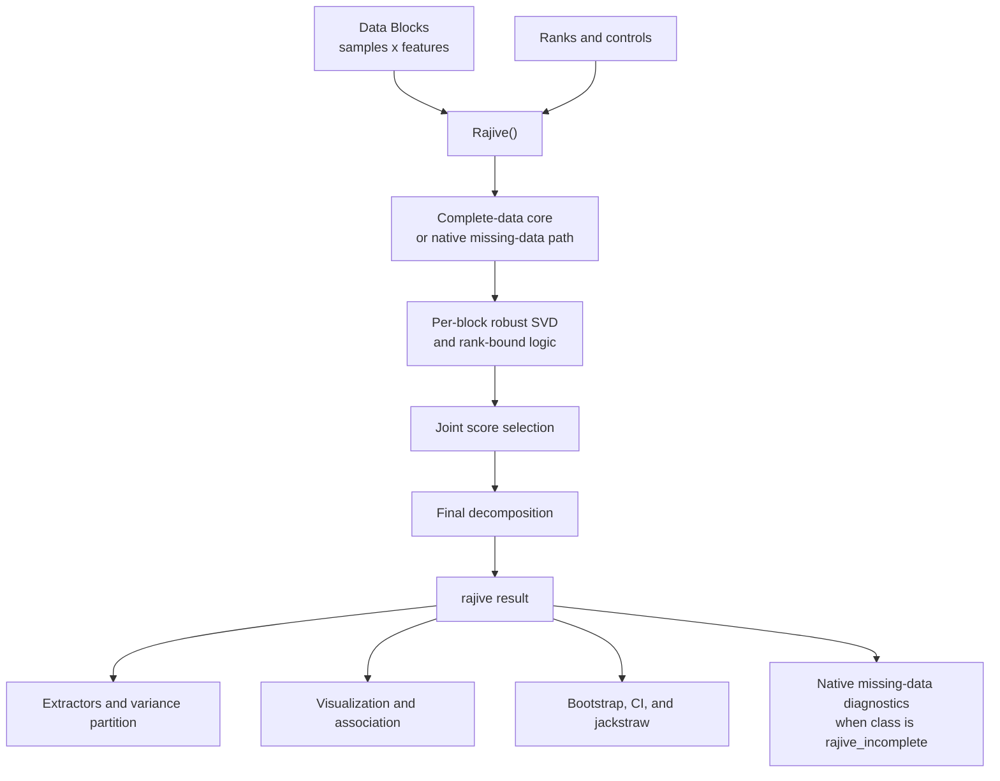

# rajiveplus Architecture Map

This is the maintainer map for the core RaJIVE+ result structure and refactor
direction. It is not a full implementation spec; use the ADRs for durable
decisions and `audits/PLANS.md` for active implementation staging.

## Reading Order

1. [../CONTEXT.md](../CONTEXT.md) for glossary-only domain language.
2. This file for the architecture map.
3. Relevant ADRs:
   - [0001 - Preserve `rajive` `block_decomps` Layout](adr/0001-preserve-rajive-block-decomps-layout.md)
   - [0002 - Use Full Component Vocabulary](adr/0002-use-residual-instead-of-noise.md)
   - [0003 - Use Strict Constructors and Scoped Reader Validation](adr/0003-strict-constructors-scoped-reader-validation.md)
4. [../audits/PLANS.md](../audits/PLANS.md) for active refactor stages and
   validation gates.

Generated pkgdown/site files under `docs/*.html`, `docs/reference/`,
`docs/articles/`, and `docs/deps/` are not active maintainer docs.

## Core Flow

## Result Objects

`rajive` is the core fitted result. Its public shape is part of the compatibility
contract:

- `block_decomps`
- `joint_scores`
- `joint_rank`
- `joint_rank_sel`

`rajive_incomplete` extends `rajive` with class order
`c("rajive_incomplete", "rajive")` and a `missing` metadata payload for Observed
Masks, estimability, reconstruction provenance, diagnostics/control,
uncertainty, censoring, and sensitivity metadata.

## `block_decomps` Contract

ADR 0001 preserves the existing `block_decomps` layout as a flat three-role
sequence per Data Block:

1. Individual Component
2. Joint Component
3. Residual Component

Internal refactors should replace repeated index arithmetic with non-exported
readers, but returned object shape should remain compatible. The record-facing
helper returns the stored decomposition record. The matrix-facing helper returns
only matrices stored in the fit or reconstructable from stored records.

## Component Vocabulary

ADR 0002 makes full component names canonical: `joint`, `individual`, and
`residual`. Public labels should be `Joint`, `Individual`, and `Residual`.

Avoid `noise` for decomposition components. Keep `noise` only where it means
stochastic error, perturbation, Monte Carlo noise, or discarded-spectrum
noise-tail estimates.

## Constructors And Readers

ADR 0003 separates write-side and read-side responsibilities:

- Constructors validate complete result schema and shape at creation time.
- Downstream readers validate only the fields they consume.
- Joint and Individual records remain plain lists.
- Residual remains a direct matrix or `NA`, not a pseudo-SVD record.
- Numeric `$full` versus `u/d/v` equivalence checks are not constructor
  responsibilities.

## Active Refactor Map

The active maintainability sequence is in [../audits/PLANS.md](../audits/PLANS.md):

- Stage 1: component vocabulary cleanup, `block_decomps` accessors, and shared
  component-matrix reconstruction.
- Stage 2: strict constructors, constructor routing, and later module splits.
- Stage 3: native missing-data research only; do not replace the current native
  algorithm as part of maintainability cleanup.
